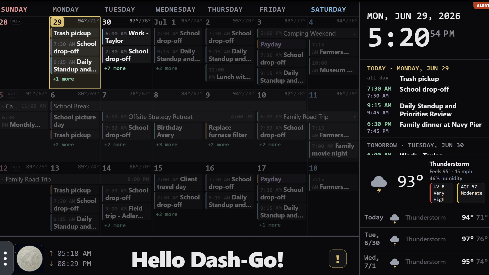
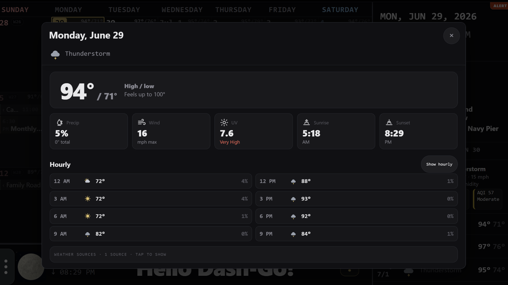
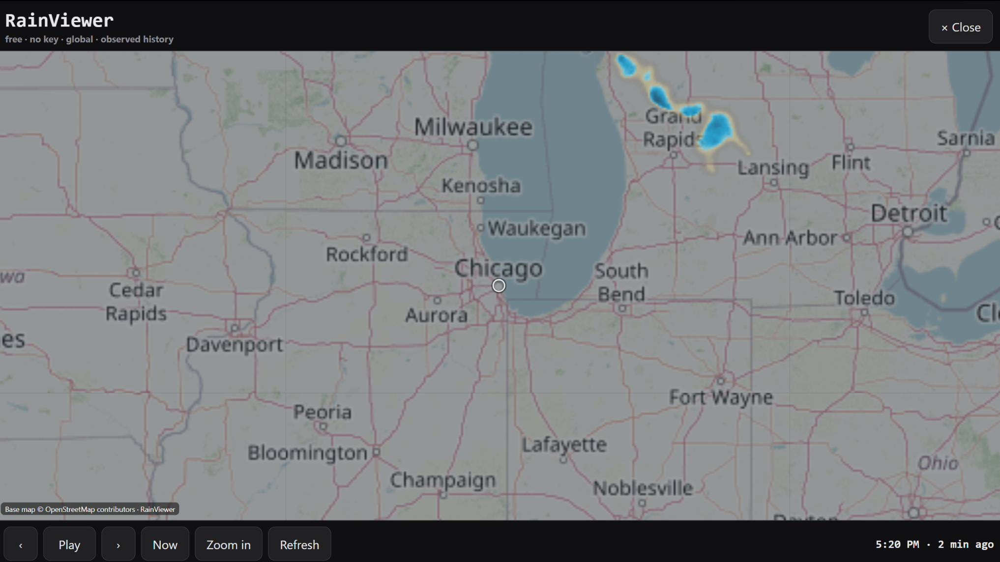
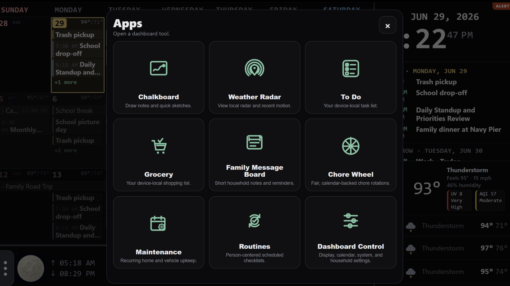
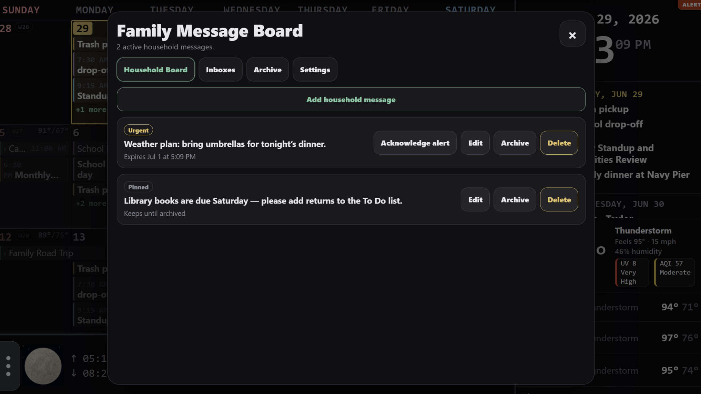
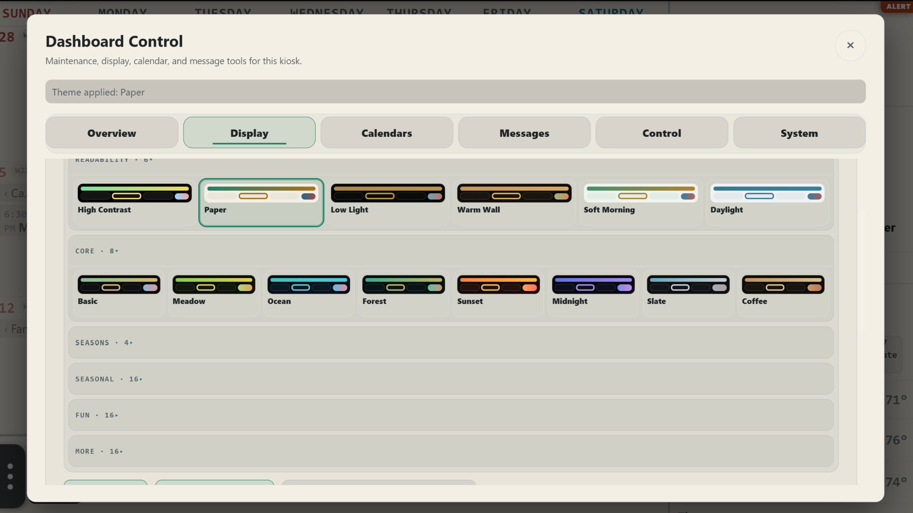

# Dash-Go

**Dash-Go** — pronounced **“Dash Dash Go”** — is a touch-first shared-household dashboard for a Raspberry Pi or small Debian kiosk. It brings calendars, weather, rotating household messages, and focused local household tools together on one calm wall-mounted display.

The dashboard control server is a local Go service. The kiosk browser talks only to `127.0.0.1:8090`.

## What Dash-Go includes

- Calendar month view, Agenda, day popups, multiday events, week numbers, visibility controls, and adjustable event typography.
- Weather forecasts, alerts, map previews, and an on-demand radar overlay.
- Large rotating household messages sized for the available display area.
- Dashboard Control for display, calendars, weather, themes, performance profiles, backups, updates, diagnostics, and safe system actions.
- Lite, Balanced, and Enhanced performance profiles.
- Local-first Apps: Chalkboard, Weather Radar, To Do, Grocery, Family Message Board, Chore Wheel, Maintenance, and Routines.
- Local backup, Doctor, repair, terminal access, and optional Control PIN protection.

## Screenshots

Dash-Go is designed for a shared wall-mounted display: calendar-first, glanceable, touch-friendly, and useful without external accounts. The screenshots below use generic Dash-Go Showcase Studio fixture data only.

<p align="center">
  
</p>

| Weather details | Weather radar |
| --- | --- |
|  |  |

| Apps launcher | Family Message Board |
| --- | --- |
|  |  |

| Dashboard Control themes |
| --- |
|  |

Additional repository-owned screenshots, including Chalkboard, Chore Wheel, Grocery, event map, alerts, and light-theme examples, are in [`docs/screenshots`](docs/screenshots).

## Recommended fresh installation: Raspberry Pi OS Lite

For a new Dash-Go device, start with **Raspberry Pi OS Lite** written with **Raspberry Pi Imager**. This is the preferred headless setup because Imager can create the user account, Wi-Fi connection, hostname, time zone, and SSH access before the Pi boots for the first time.

Use a reliable microSD card, a proper Raspberry Pi power supply, and another computer with an SD-card reader. A Raspberry Pi Zero 2 W uses 2.4 GHz Wi-Fi, so select a 2.4 GHz or dual-band network that exposes a compatible 2.4 GHz SSID.

> **Why Lite?** Dash-Go installs and manages its own kiosk session. A desktop image adds software and background work that the Dash-Go appliance does not need.

### What you need

- Raspberry Pi Zero 2 W or another supported Raspberry Pi / Debian kiosk device.
- A microSD card and card reader.
- A computer running Windows, macOS, or Linux.
- A local network. Ethernet is fine where available; Pi Zero 2 W users normally configure Wi-Fi.
- An SSH client. Windows Terminal, PowerShell, macOS Terminal, and most Linux terminals already include one.

### 1. Install Raspberry Pi Imager and select the device

Download [Raspberry Pi Imager](https://www.raspberrypi.com/software/), insert the microSD card, and open Imager. The current Imager wizard walks through **Device**, **OS**, **Storage**, **Customisation**, and **Writing**.

Choose the Raspberry Pi model you are preparing. For the usual Dash-Go appliance, select **Raspberry Pi Zero 2 W**.


### 2. Choose Raspberry Pi OS Lite and the microSD card

In **OS**, choose **Raspberry Pi OS Lite** for the selected device. On a Pi Zero 2 W, choose the current 64-bit Lite option when Imager offers it. Do not choose a desktop image for a normal Dash-Go installation.

In **Storage**, choose the intended microSD card. Verify the drive by capacity before continuing; writing erases that drive.

### 3. Configure the Pi before the first boot

Do **not** skip Customisation. Complete these pages before writing the card:

1. **Hostname** — use a simple, unique name such as `dash-go`. Use only letters, numbers, and hyphens. You will normally connect to `dash-go.local` after the first boot.
2. **Localisation** — set your country, time zone, and keyboard layout correctly. The country setting also establishes the Wi-Fi regulatory domain.
3. **User** — create the normal Linux user that will own the Dash-Go installation. Do not use `root`.
4. **Wi-Fi** — enter the correct SSID and password. For a Pi Zero 2 W, use a 2.4 GHz-capable SSID. Skip this page only when the Pi will be connected by Ethernet during first boot.
5. **Remote access** — turn on **Enable SSH**. Prefer **public key authentication** when you already use SSH keys; password authentication is acceptable for a private home network when paired with a strong unique password.

Dash-Go keeps an SSH activation and recovery path in the installer for an existing OS or another imaging workflow. That is a fallback, not the preferred path for a new headless Pi: configure SSH in Imager so the device is reachable on its first boot.

### 4. Review, write, verify, and boot

Review the summary, select **Write**, accept the erase warning, and allow Imager to complete verification. Insert the finished card into the Pi, connect power, and allow a few minutes for the first boot and network join.

### 5. Connect over SSH

From your regular computer, connect with the username and hostname chosen in Imager:

```bash
ssh YOUR_USER@dash-go.local
```

If `dash-go.local` does not resolve on your network, find the device IP address in your router or DHCP client list and connect with that address instead:

```bash
ssh YOUR_USER@192.168.1.50
```

The official Raspberry Pi documentation is the source for the Imager workflow and the screenshot above. The retained screenshot is © Raspberry Pi Ltd and licensed under [CC BY-SA 4.0](https://creativecommons.org/licenses/by-sa/4.0/).

## Install Dash-Go

Install Dash-Go as the normal user created in Raspberry Pi Imager, not as `root`.

Dash-Go installers and releases are published through the [official Dash-Go GitHub Releases page](https://github.com/DashDashGoApp/Dash-Go/releases). Each published release includes a versioned installation bundle and its checksum file.

### Download and verify a release

Set the official repository path and the release version you want to install:

```bash
REPOSITORY="DashDashGoApp/Dash-Go"
VERSION="1.5.6-beta.1"
TAG="v${VERSION}"
ARCHIVE="Dash-Go_${VERSION}_release.tar.gz"
RELEASE_BASE="https://github.com/${REPOSITORY}/releases/download/${TAG}"
```

Create a temporary download directory, download the release bundle and checksum file, then verify the bundle before extracting or running it:

```bash
mkdir -p ~/dash-go-install
cd ~/dash-go-install

curl --fail --location --proto '=https' --tlsv1.2 --retry 3 \
  -O "${RELEASE_BASE}/${ARCHIVE}"

curl --fail --location --proto '=https' --tlsv1.2 --retry 3 \
  -O "${RELEASE_BASE}/SHA256SUMS"

sha256sum --ignore-missing --check SHA256SUMS
```

A successful check reports:

```text
Dash-Go_1.5.2_release.tar.gz: OK
```

Do not continue if checksum verification fails.

Extract the verified release bundle and run its installer:

```bash
tar -xzf "${ARCHIVE}"
cd "Dash-Go_${VERSION}"
chmod +x install.sh
./install.sh
```

Dash-Go installs its local dashboard files, kiosk session, service, and maintenance helpers. It keeps Dash-Go settings and secrets outside browser-served dashboard content with owner-only permissions where Dash-Go manages those files.

Do not use `curl | bash` or install Dash-Go from unverified mirrors, copied scripts, pull requests, forks, or release assets that are not published through the official Dash-Go GitHub repository.

### Release integrity

Dash-Go releases are published as immutable GitHub Releases. The downloaded bundle is checked against the release checksum file before it is extracted.

During installation and normal updates, Dash-Go also validates the staged release contents, selected architecture binary, generated browser assets, and managed-file replacement process before replacing the running dashboard.

### Maintainer release process

Dash-Go is distributed publicly through the official GitHub repository and GitHub Releases. The installed updater remains anonymous: do not put a GitHub token on a Dash-Go VM or Pi.

Maintainers build release assets locally, verify `SHA256SUMS` and GitHub-reported asset digests, create a draft release for review, then publish and run the public-release probe. The concise current workflow is in [`RELEASING.md`](RELEASING.md).

## First dashboard setup

The installer guides the first configuration. Afterwards, open **Apps** from the dashboard footer, then choose **Dashboard Control**.

- **Status / Control** — performance profile, quick actions, system and power actions.
- **Calendars** — calendar visibility, health, management, start day, week numbers, and event text.
- **Weather / Display / Themes** — weather behavior, typography, sleep/dim behavior, and visual settings.
- **Lists** — local To Do and Grocery destinations, optional Microsoft To Do, and the optional Bottom Lists dock.
- **Update / Backup / Restore** — updates, local configuration backups, restore, and concise update history.
- **Diagnostics / Terminal** — Doctor evidence, memory inspection, repair planning, private diagnostics export, and the local maintenance terminal.

Dashboard Control opens with **Device status** ready for a glance. All other cards stay collapsed and lazy until you open the section you need.

### Performance profiles

Choose one explicit profile; updates do not silently reapply it:

- **Lite** — Pi Zero and other low-memory kiosk-safe behavior.
- **Balanced** — normal home kiosk behavior.
- **Enhanced** — more capable devices.

For a Raspberry Pi Zero 2 W, use **Lite**. On the known 1080p setup, `gpu_mem=32` is the stable Surf/WebKit setting.

## Updates, Doctor, and repair

Dash-Go updates use the official Dash-Go GitHub Releases page for the installed release track. Normal updates preserve personal settings, calendars, themes, weather choices, messages, location, PIN/security settings, and household-app data.

| Command | Use it for |
| --- | --- |
| `~/install.sh --update` | Check GitHub Releases and install a newer compatible Dash-Go release. |
| `~/install.sh --doctor` | Run a quiet health scan, then offer safe fixes. |
| `~/install.sh --doctor --full` | Show a detailed health report with individual fixes. |
| `~/install.sh --repair` | Restore the exact installed Dash-Go release while preserving personal settings and calendars. |
| `~/install.sh --repair --update` | Explicitly repair using the newest eligible GitHub Release. |
| `~/install.sh --repair --reset-profile` | Repair the exact installed release and intentionally restore detected performance-profile defaults. |
| `~/install.sh --repair --system` | Also repair Dash-Go’s service, autologin, kiosk wiring, and scheduler. |
| `~/install.sh --repair --system --packages` | Also install missing runtime packages; requires network and sudo. |
| `~/install.sh --remove` | Run the offline Dash-Go-only uninstall workflow. |
| `~/install.sh --remove --dry-run` | Show project-owned artifacts without changing anything. |

Use plain `--repair` first for damaged application files when you need to restore the currently installed version exactly. Use `--repair --update` only when you deliberately want the newest eligible release. Add `--system` only when the service, autologin, kiosk launch, or scheduled maintenance is damaged. Add `--packages` only when Doctor identifies missing operating-system dependencies.

A normal update stages and verifies the downloaded release before replacement, restarts the local service, confirms readiness, and relaunches the tracked Dash-Go kiosk process. An ordinary update should not return the kiosk to the login screen.

## Everyday use

### Calendar and Calendar Manager

Colored calendar chips remain the fast show/hide control. Use **Dashboard Control → Calendars → Manage calendars** when a calendar needs deeper work.

- **Delete local calendar** moves a managed `.ics` file to Calendar Trash, where it can be restored for 30 days.
- **Remove calendar link** archives only Dash-Go’s symlink; the external target is not changed.
- **Stop calendar output** for Chore Wheel, Maintenance, or Routines removes the generated feed while retaining the app’s data and history.
- **Repair calendar index** rebuilds Dash-Go’s calendar registration and cache without deleting calendar files.

### Weather and radar

Triple-tap the current-weather panel to open Weather Radar. Radar works on demand and stays bounded on Lite. Use **Dashboard Control → Display** for calendar text, weather detail, and display behavior.

### Household Apps

Apps load only when opened and use the shared Dash-Go overlay, theme, touch controls, and on-screen keyboard.

- **Chalkboard** — quick sketches and written family notes.
- **Weather Radar** — current local radar and recent motion on demand.
- **To Do / Grocery** — local household tasks and shopping items, with optional Microsoft To Do synchronization.
- **Family Message Board** — household notes plus optional private person-to-person inboxes.
- **Chore Wheel** — fair chore assignment with optional limited-horizon calendar output.
- **Maintenance** — recurring home, vehicle, and pet upkeep.
- **Routines** — person-centered recurring checklists with optional calendar output.

## Optional connections

### CalDAV calendars

Choose **Add CalDAV calendar** from the installer’s calendar-sync menu for iCloud, Nextcloud, Fastmail, Radicale, or another standard CalDAV service. Dash-Go keeps the account credentials outside the served dashboard tree and syncs the chosen collection into a local Dash-Go calendar.

### Microsoft To Do

To Do and Grocery remain useful locally without a Microsoft account. Linking Microsoft To Do is opt-in: map each launcher tile deliberately, keep local data local until you choose a migration, and use **Sync now** when an immediate catch-up is useful after a phone change.

### Notifications (Apprise-Go)

Dash-Go can send selected Family Message Board events through Apprise-Go routes configured over SSH. The touchscreen manages only non-secret delivery preferences; provider URLs, destination addresses, and tokens stay out of the dashboard.

## Terminal access

The optional Dashboard Control terminal card is managed from SSH. Check its current state with:

```bash
~/dashboard/bin/dashboard-terminal-access status
```

To enable or disable the card, rerun the installer and choose **Terminal access**. Terminal access is intended for the local administrator; leave it disabled when the touchscreen should not offer a maintenance shell.

## Security and privacy

- The dashboard control server binds to loopback by default. Do not expose it through a reverse proxy or public network binding.
- An optional Control PIN protects sensitive writes and terminal access. Control and personal-inbox PIN failures use a persistent escalating cooldown; browser-facing status does not expose PIN verifier material.
- **Every control open** uses a short server-side session that is refreshed only while Dashboard Control remains open, rather than relying solely on browser close cleanup.
- If the Control PIN is forgotten, a local administrator with SSH can create the one-shot reset flag and restart the service:

  ```bash
  touch ~/.dashboard-control-pin-reset
  sudo systemctl restart dashboard-server
  ```

  The service consumes the flag once, disables only the Dashboard Control PIN, clears its lockout state, and removes the flag. It does not reset personal inbox PINs or other dashboard data.
- Install Dash-Go only from the official [GitHub repository](https://github.com/DashDashGoApp/Dash-Go) and GitHub Releases.
- Do not use an unsafe verification-bypass option for normal installation or updates.
- Weather keys, calendar credentials, Microsoft refresh tokens, private Family Message Board records, and notification-route secrets remain outside served dashboard content.
- Prefer scoped sudo permissions over broad passwordless sudo.
- Review [PRIVACY.md](PRIVACY.md), [INTEGRATIONS.md](INTEGRATIONS.md), and [SECURITY.md](SECURITY.md) before enabling optional outside services.

## Troubleshooting

### The dashboard does not load after an update

```bash
curl -fsS http://127.0.0.1:8090/api/ready
systemctl status dashboard-server --no-pager
journalctl -u dashboard-server -n 80 --no-pager
curl -s http://127.0.0.1:8090/api/status
```

`/api/ready` should report `goServer: true` and the installed version. Also inspect `~/dashboard/cache/update-status.json` and `~/dashboard/logs/update.log`.

### Surf/WebKit still looks stale after an update

Allow the local readiness check to finish. When `/api/ready` reports the installed version but the display remains stale, use Dashboard Control’s **Restart Browser** action or reboot the kiosk. Do not use a broad `pkill -x surf`, which can close unrelated local Surf sessions.

### A storage notice persists after a clean reboot

Dash-Go refreshes its small storage canary shortly after startup and during daily low-priority housekeeping. A prior-boot kernel-log-only warning is ignored after a clean reboot; a read-only mount, failed canary, low space, or current-boot I/O/filesystem evidence remains actionable. Inspect the current result with:

```bash
~/dashboard/bin/dashboard-storage-wear.sh
cat ~/dashboard/cache/storage-wear-state.json
```
